# Getting Started

This walkthrough takes you from a blank application to a published, locked report pack. It covers the full lifecycle — building a report, composing a pack, publishing, locking, and rolling forward to the next period.

> **Before you begin:** The application must be running and connected to your TM1 server. If you haven't set it up yet, see the [Deployment Guide](DEPLOYMENT.md).

---

## 1. Open the Builder

Navigate to the Builder at `/builder`. You'll see the main layout:

- **Left sidebar** — tabs for Reports, Packs, Visuals, and Images
- **Centre canvas** — live preview of the selected report
- **Right panel** — tabbed properties (Source, Columns, Rows, Format, CF)

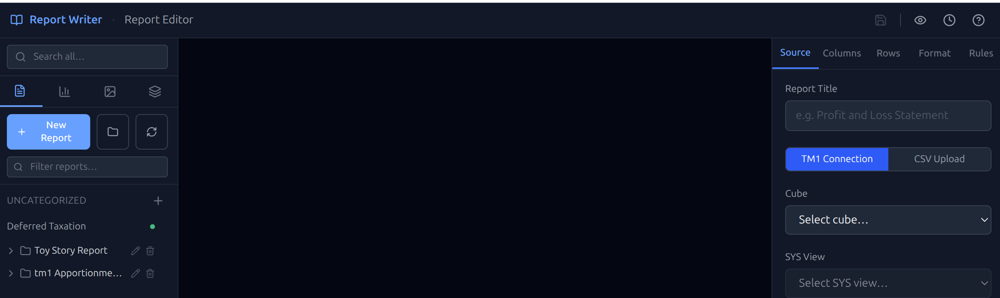

---

## 2. Create Your First Report

Reports can be connected to **TM1** or built from a **CSV file**. Both types go through the same columns, rows, and format steps.

### Option A — Connect to TM1

1. Click **New Report** at the top of the sidebar
2. In the **Source** tab, make sure the toggle is set to **TM1**
3. Select your **Cube** from the dropdown — only cubes you have access to will appear
4. Select a **View** — only `SYS` prefix views are shown
5. The report renders a live preview immediately in the canvas

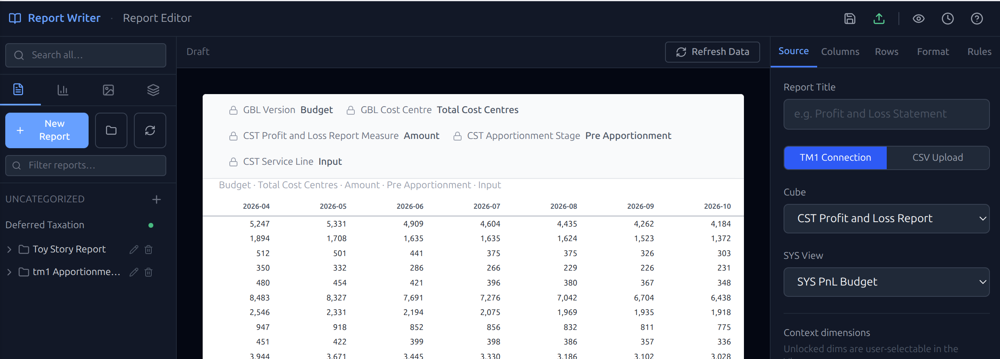

### Option B — Upload a CSV

Use CSV when data comes from outside TM1 — a spreadsheet export, a non-TM1 system, or a one-off dataset.

1. Click **New Report** at the top of the sidebar
2. In the **Source** tab, switch the toggle to **CSV**
3. Drop or browse to a `.csv` file — the app parses it immediately

#### Format detection

The app auto-detects the file format and shows the result next to the **Format** toggle. Two formats are supported:

**Cross-tab** (matrix layout) — the most common for financial exports. Rows are line items, columns are periods or entities. The first row is column headers, the first column is row labels.

```text
           Jan    Feb    Mar
Revenue   1000   1100   1200
Costs      800    850    900
```

**Tabular** (one row per value) — a normalised list with separate columns for the row dimension, column dimension, and value. Common in database exports.

```text
Entity    Period   Measure    Value
UK        Jan      Revenue    1000
UK        Jan      Costs       800
```

If the auto-detection picks the wrong format, use the **Auto / Cross-tab / Tabular** toggle to override it.

#### Cross-tab options

| Option | Description |
| --- | --- |
| **Swap rows and columns** | Tick if periods run down the rows in your CSV rather than across the columns |
| **Row dimension name** | Label for the row axis — shown in the report (default: Rows) |
| **Column dimension name** | Label for the column axis — shown in the report (default: Columns) |

#### Tabular options

| Option | Description |
| --- | --- |
| **Row dimension** | The column in your CSV that contains the row labels (e.g. Entity) |
| **Column dimension** | The column that contains the column labels (e.g. Period) |
| **Value field** | The numeric column to use as the data values |
| **Filters** | Slice the data by any remaining text column — e.g. filter to a single Measure when your CSV contains multiple measures |

#### Confirming and refreshing

- Click **Confirm** — columns and rows are auto-populated from the CSV data and a live preview appears

Once a CSV report has been confirmed, two update options appear:

| Option | When to use | What it does |
| --- | --- | --- |
| **Refresh** | New data, same structure (e.g. next month's numbers) | Uploads a new file, validates that the column and row counts match, updates the values. Column labels are re-mapped automatically if they changed (e.g. period names). Your column and row formatting is fully preserved. Fails with an error if the structure doesn't match. |
| **Replace** | The structure has changed (e.g. different columns or rows) | Discards the existing configuration and starts fresh — re-upload and reconfigure from scratch. |

> CSV reports behave identically to TM1 reports in the Composer and Viewer. Selectors are fixed — viewers cannot switch context on a CSV report.

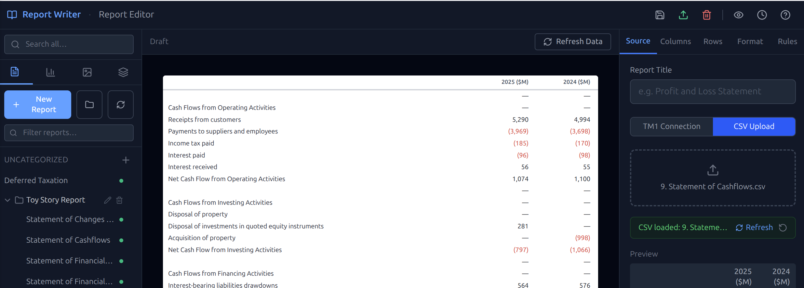

### Configure Selectors (TM1 only)

Selectors appear as dropdowns above the report, letting viewers switch context (e.g. change the period or entity) without needing separate reports.

Each dimension on the filter axis becomes a selector automatically.

#### Locking and unlocking selectors

Each selector has a **lock icon** on the right:

- **Locked** (padlock closed) — the selector is fixed at the default value. Viewers see the value but cannot change it.
- **Unlocked** (padlock open, shown in blue) — the selector becomes a live dropdown in the Viewer. Viewers can switch to any member of that dimension.

Click the padlock to toggle. For example, unlock your **Entity** dimension so viewers can switch between subsidiaries, but leave **Period** locked if this report is always for a specific month.

You can also set a **Label** on each selector to override the TM1 dimension name with something more readable (e.g. "Period" instead of "}Period_Financial").

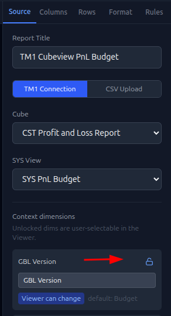

### Add Columns

1. Click the **Columns** tab
2. Click **Add Column** and pick a TM1 member from the list
3. Set a **Label** to override the TM1 member name if needed
4. Use **Width** (Narrow / Normal / Wide) to control column sizing

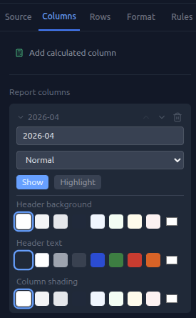

### Add a Calculated Column

Calc columns derive a value from two existing columns — useful for variances and percentages.

1. Click **Add Calc Column**
2. Pick the **Base** column (e.g. Actual)
3. Pick the **Comparison** column (e.g. Budget)
4. Choose the **Type**:
   - **Variance** — Base minus Comparison (e.g. Actual − Budget)
   - **% Variance** — Variance as a percentage of the Comparison
   - **% of Base** — Comparison as a percentage of Base
5. Set a **Label** (e.g. "Variance", "Var %")
6. Set **Favorable Direction** — whether a positive or negative result is "good" (controls red colouring)

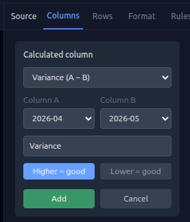

### Build Rows

1. Click the **Rows** tab
2. Click **Add Row** and pick TM1 members from your row axis
3. Set each row's **Type** — `data`, `total`, `subtotal`, `header`, or `spacer`
4. Use **Indent** to create visual hierarchy
5. Tick **Bold** on total rows, set **Border Above** to `double` for a professional total line
6. Use **Sign Flip** on expense rows where TM1 stores values as positive but you want them displayed as negative

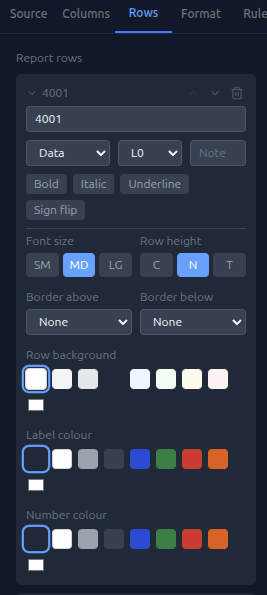

### Format the Report

1. Click the **Format** tab
2. Set a **Title** — this appears above the table in the pack
3. Set **Scale** (Thousands / Millions) and **Decimals**
4. Choose **Negative Style** — brackets `(123)` are standard for financial reports
5. If you have many columns, try **Table Density: Dense** or **Compact** to fit more on the page

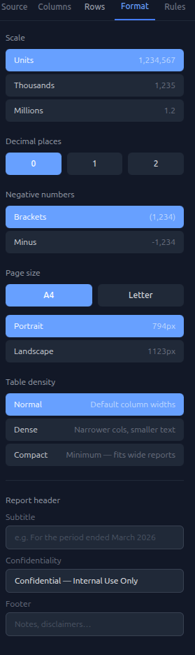

### Set Conditional Formatting (CF)

CF rules highlight cells automatically when values meet a condition — for example, turning a variance red when it exceeds a threshold.

1. Click the **Rules** tab
2. Click **Add Rule**
3. Set the **Scope** — `Row` (applies to all cells in a row) or `Column` (all cells in a column)
4. Pick the **Target** — which row or column the rule applies to
5. Set the **Operator** — `>`, `>=`, `<`, `<=`, `=`, `!=`, or `between`
6. Enter the **Value** — the threshold (raw number, before scale)
7. Set the formatting to apply — **Colour**, **Background**, **Bold**, or **Italic**

Multiple rules can be added and will be evaluated in order.

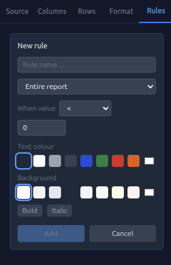

---

## 3. Publish the Report

The report is currently **Grey (Draft)** — only visible in the Builder.

1. Click **Publish** in the top toolbar
2. The status indicator turns **Green (Published)**
3. The report is now eligible for inclusion in a pack

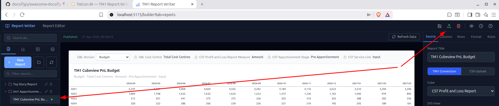

---

## 4. Create a Visual

Visuals are KPI tiles and charts that sit alongside reports in a pack.

Visuals connect to the same data sources as reports — either a TM1 cube/view or a CSV file.

1. Click the **Visuals** tab in the sidebar
2. Click **New Visual**
3. In the **Source** panel, select the visual type — **KPI**, **Bar**, **Line**, or **Pie**
4. Connect to your data source:
   - **TM1** — select a Cube and View (same as a report)
   - **CSV** — upload a file using the same cross-tab or tabular format as reports
5. Configure the visual:
   - **KPI** — pick the row and column member for the main value; optionally add a comparison value and label
   - **Chart types** — pick which columns to plot and set axis labels and colours
6. Set a **Title** and adjust the **Number Format** (scale, decimals)
7. Click **Save Draft**, then **Publish** — status turns **Green**

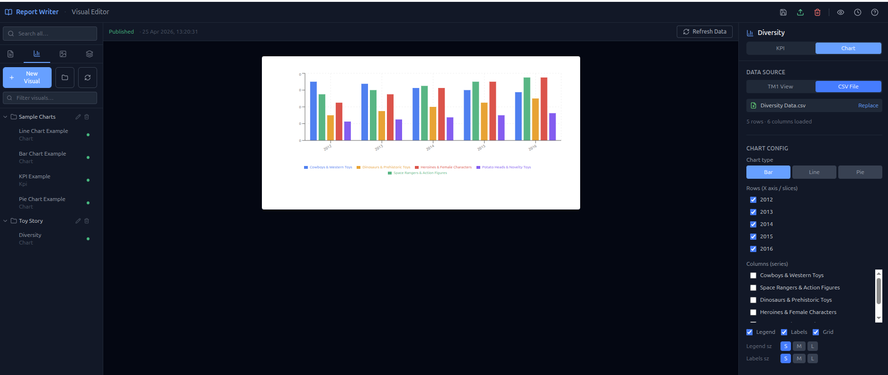

---

## 5. Create a Pack

A pack is an ordered collection of pages that becomes the report your finance users read.

1. Click the **Packs** tab in the sidebar
2. Click **New Pack** — give it a name (e.g. "Monthly Management Accounts — April 2026")
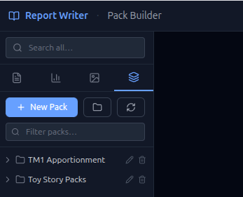

3. Click **Open in Composer** — this opens the full-page layout editor
(Note make sure your new pack is in context when you click the Composer icon.
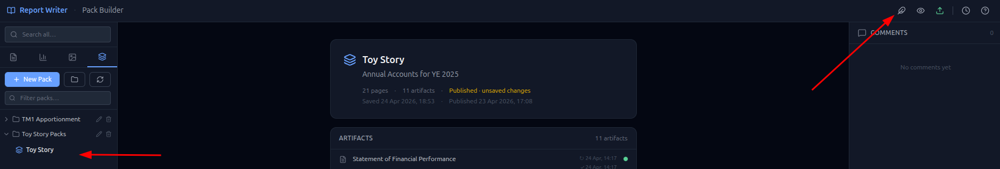

---

## 6. Compose the Pack

### Configure the Header

1. Click the **gear icon** in the Composer toolbar to open Pack Settings
2. Set **Company Name** and **Report Title** — these appear in the header bar on every page
3. Pick a **Logo** from the image library (upload your logo first via the Images tab in the Builder if needed)
4. Optionally set a **Background Colour** for the header bar


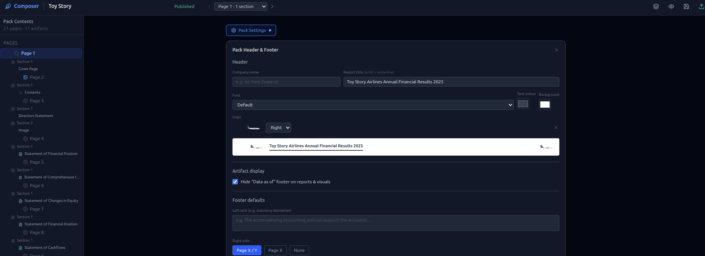

---

### Add a Page

Click **Add Page** at the bottom of the Composer canvas to append a new blank page.

Each page in the sidebar shows a small orientation icon — a tall rectangle for portrait, a wide rectangle for landscape. This lets you see the page mix at a glance without opening each one.

> **Insert between pages:** To add a page between two existing pages, hover over the divider between them and click the **Insert Page** button that appears. The new page is inserted at that position — no need to drag.


---

### Page Settings

Click the orientation icon on any page to open its settings panel.

| Setting | Description |
| --- | --- |
| **Orientation** | Landscape (default, A4 297×210mm) or Portrait (A4 210×297mm) — choose per page |
| **Background colour** | Solid colour fill for the page behind all content |
| **Background image** | Pick an image from the library to use as a full-page background |
| **Overlay opacity** | A translucent colour wash over a background image — useful for muting a busy photo |
| **Overlay colour** | The colour of the overlay wash |
| **Hide header** | Suppresses the company name / logo bar on this page — useful for cover pages |
| **Hide footer** | Suppresses the page number / footer bar on this page |
| **Footer left text** | Override the default footer text on this page only — set to a space to leave it blank |

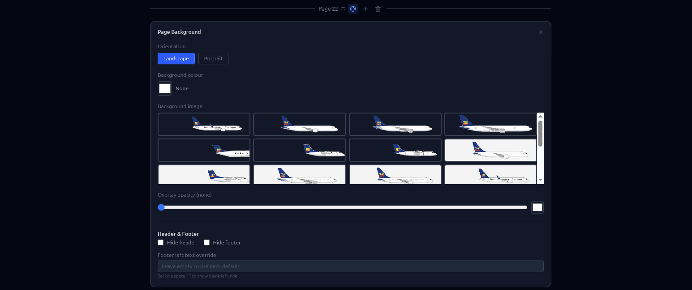

---

### Add Sections

A page is built from **sections** stacked vertically. Each section holds one or more slots side-by-side. Click **Add Section** on a page and pick a layout preset:

#### Single-row presets

| Preset | Slot widths |
| --- | --- |
| 100 | One full-width slot |
| 50 / 50 | Two equal halves |
| 66 / 33 | Wide left, narrow right |
| 33 / 66 | Narrow left, wide right |
| 33 / 33 / 33 | Three equal thirds |
| 25 / 75 | Quarter left, three-quarters right |
| 75 / 25 | Three-quarters left, quarter right |
| 25 / 50 / 25 | Side margins with wide centre |
| 50 / 25 / 25 | Wide left, two small right |
| 25 / 25 / 25 / 25 | Four equal quarters |

#### Multi-row presets

Combine two rows in one section (e.g. a full-width header row above a three-column row).

`1 + 3`, `3 + 1`, `1 + 2`, `2 + 1`, `1-1 + 1-1`, `1 + 1-1 + 1-1`, and more.

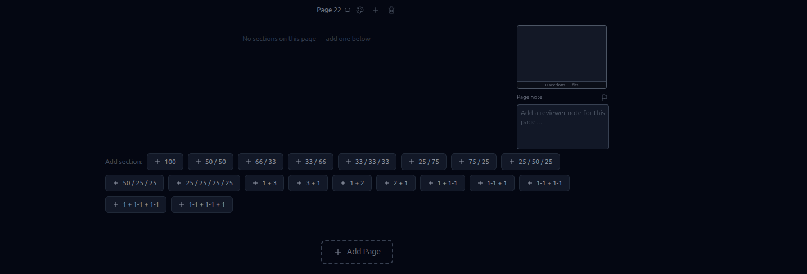

Once a section is placed you can adjust two settings at the bottom of the section bar:

| Setting | Options | Description |
| --- | --- | --- |
| **Gap below** | None / Tight / Normal / Wide | Controls the vertical space between this section and the next |
| **Height** | Auto / 20% – 80% / custom % | Forces the section to a fixed percentage of the page height — useful for cover layouts and divider rows. Auto sizes to content |

---

### Add Content to a Slot

Click any empty slot to open the slot type picker:

| Type | Description |
| --- | --- |
| **Report** | A published data table from the Builder — live TM1 or CSV |
| **Visual** | A chart or KPI tile from the Builder |
| **Image** | A static image from the shared image library |
| **Text** | A rich text editor — headings, bold, italic, lists, links |
| **Contents** | Auto-generated table of contents — lists all labeled slots across the pack |
| **HTML** | Custom HTML and CSS — full creative control for cover pages, dividers, and branded layouts |
| **Signature** | Executive sign-off block with name, title, and signature image fields |

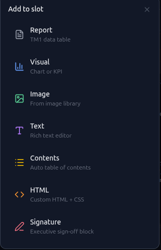

After picking a type and selecting the content, each slot has additional settings in its toolbar:

Common to most slot types:

| Setting | Description |
| --- | --- |
| **Label** | Name shown in the Table of Contents|
| **Background colour** | A colour wash behind the slot content |
| **Background opacity** | How opaque the background wash is — 0% transparent, 100% solid |

In each slot you can click the "change slot type icon" to change to another type.


### Report or Visual 
Within slot you can edit by selecting the pencil, this will open the edit tab where you and then save and republish the artifact. Note you must republish for changes to register in a pack. 

### HTML Slot

The HTML slot is the most powerful slot type in the Composer. Where Report, Visual, Text, and Image slots are structured and constrained, the HTML slot gives you a blank A4 canvas and lets you write any HTML and CSS you want — full creative control over layout, typography, colour, and spacing.

Every HTML slot is rendered in a sandboxed iframe at A4 landscape dimensions (297×210mm) and scaled to fit the slot width. The sandbox blocks JavaScript and external resources, so layouts are static and self-contained, but within those constraints anything that can be done with HTML and CSS is available — multi-column grids, full-bleed colour panels, data tables, cover page artwork, branded section dividers, and more.

#### CSS Presets

Styling from scratch each time gets repetitive. The CSS preset dropdown applies a base stylesheet that matches the slot to your pack's brand colour automatically:

| Preset | Font size | Best for |
| --- | --- | --- |
| **Default** | 11px | General-purpose commentary and layout |
| **Dense** | 9pt | Text-heavy notes where space is tight |
| **Annual Report** | 8.5pt | Long-form narrative, annual reports |
| **Corporate** | 9.8pt | Mid-weight balanced layout, includes two-column helper class |
| **Cover Page** | 12pt | Large headings, cover pages and section dividers |

Presets inject heading colours, table styles, paragraph spacing, and list formatting — all keyed to your pack brand colour. Your own `<style>` tags always override the preset, so you can start from a preset and tweak freely.

#### Writing HTML with an AI Assistant

Writing layout HTML from scratch is time-consuming. The HTML slot includes a **Copy LLM prompt** button (in the HTML tips panel) that copies a pre-built prompt to your clipboard. Paste it into Claude, ChatGPT, or any other AI assistant, describe what you want in plain English at the end, and paste the generated HTML directly into the slot.

The prompt pre-loads the AI with the exact constraints the renderer enforces — correct font size, no external resources, no JavaScript, correct root element sizing, proportional headings, table styling conventions — so the output works first time rather than needing correction.

For example: *"A cover page with the company name large on the left, a vertical colour bar on the right, and a date line at the bottom"* or *"A two-column commentary box with a heading, three bullet points left, and a small table on the right"* — both can be produced in seconds and dropped straight into the Composer.

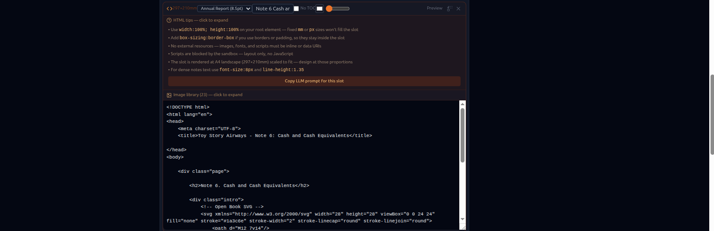


---

### Section Gap and Tightness

The **Gap below** setting on each section controls how tightly content stacks on the page:

- **None** — sections butt up against each other — good for full-bleed designs
- **Tight** — minimal breathing room — maximises content density
- **Normal** — balanced default spacing (recommended for most pages)
- **Wide** — generous whitespace — useful when a page has only one or two sections

Use **Height** on sections to pin a section to a specific proportion of the page — for example, set a divider section to 10% height so it stays a thin strip regardless of the content below it.


### Add a TOC Page

For packs with multiple pages, add a Table of Contents:

1. Add a new page at position 2 (after a cover page)
2. Add a full-width section and pick **Contents** as the slot type
3. The TOC auto-generates from all labeled slots across the pack — set a **Label** on each report and visual slot to include it

---

## 7. Publish the Pack

1. Click **Save Draft** to save your layout
2. Click **Publish Pack** — the app validates that all included artifacts are **Green (Published)**
3. If any artifact is Grey or Yellow, the publish is blocked — go back to the Builder and publish those artifacts first
4. Once published, the pack is live in the Viewer at `/viewer`

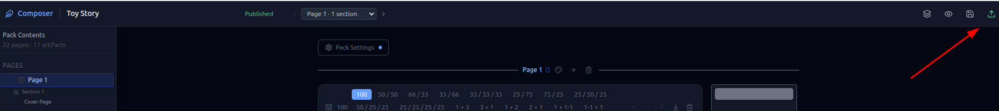

---

## 8. View in the Viewer and Publish to PDF

Open `/viewer` to see what your finance users see:

- Select the pack from the left sidebar
- Use the **Table of Contents** to jump between sections
- Selectors at the top let users switch period or entity context
- Click **Export PDF** to download a properly formatted A4 PDF

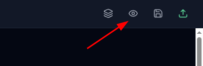
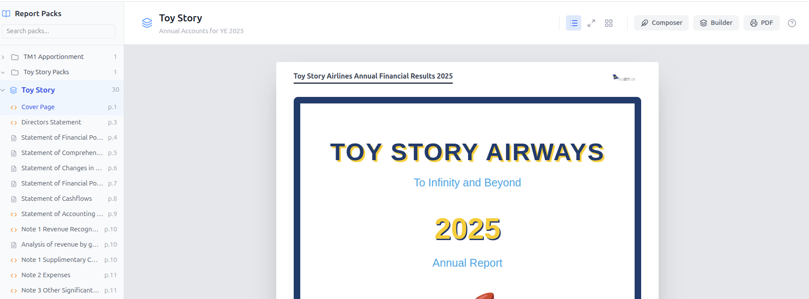
---

## 9. Lock the Pack

Once the pack has been signed off and the reporting period is closed, lock it to freeze the data permanently.

1. Open the pack in the Builder
2. Click **Lock Pack** in the toolbar
3. Confirm — the app deep-copies all artifact definitions and fetches live TM1 datasets as frozen snapshots
4. The lock is **permanent** — the Viewer will always read from the snapshot, never from TM1 again

> Use locking for regulatory, audit, or board packs where the data must not change after sign-off.

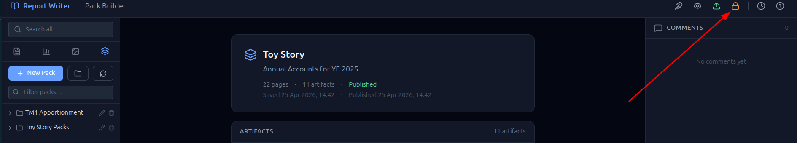

---

## 10. Roll Forward

When the next reporting period arrives, use Roll Forward to create a new draft pack from the locked pack as a template.

1. Select the Locked Pack in Builder
2. Click **Roll Forward**
3. A new draft pack is created — layout, text slots, and images are copied verbatim
4. TM1-backed slots (reports, visuals) are copied but unlinked — flagged as "needs linking"
5. Open the new pack in the Composer and re-link each report and visual slot — update the period selector to the new period
6. Publish when ready

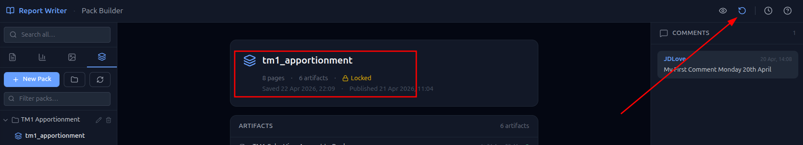

---

## 10. Comments 

Pack Comments 
Add on Pack Builder Tab, right panel, general comments or reminders when building pack. History kept as control.

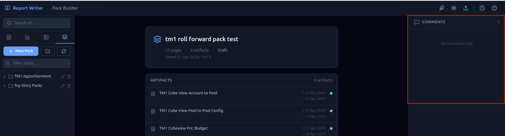

Compose Page Comments with Flag
Add in Composer by Page, can flag which will show as red in Pack Builder summary. Pack will not be able to be published until flag removed)
History kept as control.

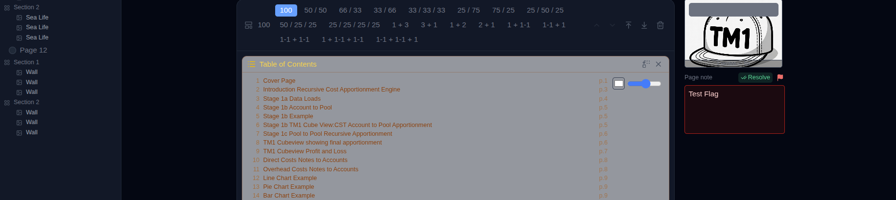

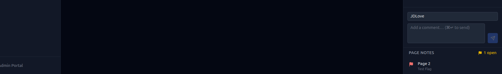


## Summary — The Full Lifecycle

```text
New Report → Publish (Grey → Green)
New Visual → Publish (Grey → Green)
New Pack   → Compose → Save Draft → Publish Pack
           → Viewer goes live
           → Lock (data frozen, permanent)
           → Roll Forward → new draft for next period
```

That's the complete cycle. Each period you Roll Forward, update the selectors, and re-publish — the layout and commentary carry forward automatically.
